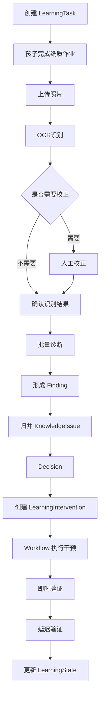

# 纸质作业端到端（五年级数学案例）

```mermaid
flowchart TD
    A[创建 LearningTask] --> B[孩子完成纸质作业]
    B --> C[上传照片]
    C --> D[OCR识别]
    D --> E{是否需要校正}
    E -->|需要| F[人工校正]
    E -->|不需要| G[确认识别结果]
    F --> G
    G --> H[批量诊断]
    H --> I[形成 Finding]
    I --> J[归并 KnowledgeIssue]
    J --> K[Decision]
    K --> L[创建 LearningIntervention]
    L --> M[Workflow 执行干预]
    M --> N[即时验证]
    N --> O[延迟验证]
    O --> P[更新 LearningState]
```

**验收要点：** 原始作答不被覆盖；未确认 OCR 不参与归因；即时与延迟验证是独立真实作答；State 更新有 Revision 与依据。

设计层 E2E 曾通过检查；数据库执行验收：`NOT_RUN`。
